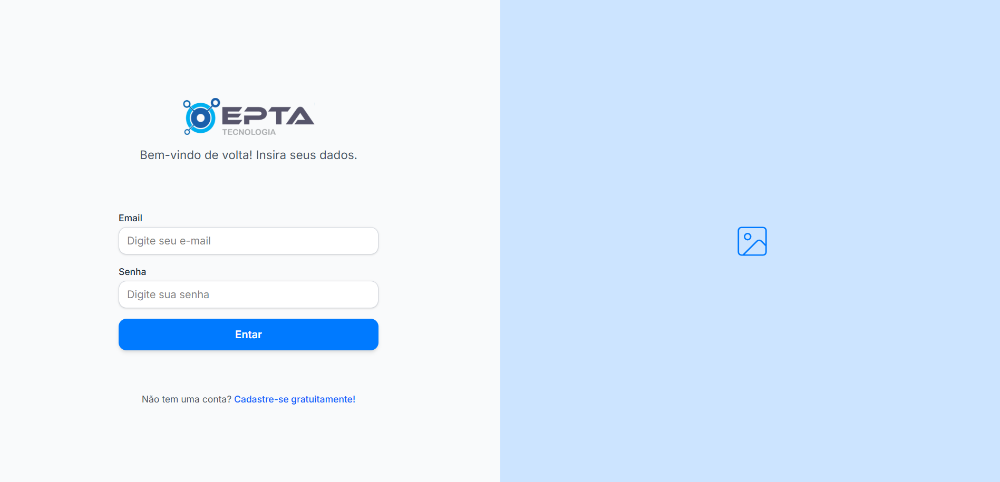

# 💻 Front-end – [Desafio FullStack EPTA]

Este é o repositório da interface web do projeto, desenvolvida com Vite, React, TypeScript e Tailwind CSS. A aplicação conta com rotas públicas e privadas, autenticação via contexto, e se comunica com a API back-end utilizando Axios.
A interface é totalmente responsiva, adaptando-se perfeitamente a dispositivos móveis, tablets e desktops, proporcionando uma navegação fluida em diferentes tamanhos de tela.

- Com esta interface, é possível:

  - Realizar login e cadastro de usuários;

  - Acessar um painel com informações personalizadas;

  - Gerenciar veículos associados ao usuário;

  - Navegar entre telas protegidas com base na autenticação;

  - Visualizar mensagens e alertas com uma experiência responsiva e moderna.

---

## 🚀 Tecnologias Utilizadas

[](https://skillicons.dev)

- **React Router DOM**
- **React Hook Form**
- **Context API**
- **Axios**

---

## ⚙️ Como Rodar o Projeto Localmente

Antes de iniciar, **certifique-se de que o back-end está rodando corretamente e acessível**.
👉 Você pode ver mais detalhes sobre como configurar o back-end [neste link](../backend/README.md).

### 1. Clonar o repositório

```bash
git clone https://github.com/alyssonrafael/Desafio_EPTA_Fullstack
```

### 2. Entar no diretorio Frontend

```bash
cd Desafio_EPTA_Fullstack/frontend
```

### 3. Instalar as dependências

```bash
npm install
```

### 4. Configurar a base URL no arquivo src/api.ts

Se o back-end estiver rodando na porta 3333, não é necessário alterar nada.
Caso esteja utilizando outra porta, localize o trecho:

```bash
baseURL: "http://localhost:3333/api",
```

E substitua a porta 3333 pela porta correta onde seu back-end está rodando.
Isso garante que as requisições sejam enviadas para a API corretamente.

## 🔐 Autenticação

A aplicação possui:

- **Rotas públicas** : acesso livre (ex: login, cadastro, notFound)
- **Rotas privadas** : acessíveis apenas com autenticação (via JWT)
- O token JWT é armazenado localmente e gerenciado via Context API
- As requisições são feitas com Axios, utilizando interceptadores para autenticação automática

## 📁 Estrutura Principal do Projeto

- 📦 **src/** – Diretório principal da aplicação

  - 📁`assets/` – Imagens, ícones e outros arquivos estáticos
  - 📁 `components/` – Componentes reutilizáveis da interface (botões, inputs, cards etc.)
  - 📁 `contexts/` – Context API (autenticação, usuario e veiculos)
  - 📁 `pages/` – Páginas principais da aplicação (Login, Dashboard, NotFound etc.)
  - 📁 `routes/` – Definição de rotas públicas e privadas usando React Router
  - 📄 `api.ts` – Configuração do Axios e integração com a API
  - 📄 `App.tsx` – Componente raiz da aplicação, define estrutura geral
  - 📄 `index.css` – Estilos globais e configuração do Tailwind CSS
  - 📄 `main.tsx` – Ponto de entrada da aplicação (renderiza o App)
  - 📄 `types.ts` – Tipagens e interfaces globais usadas no projeto
  - 📄 `vite-env.d.ts` – Arquivo de declaração para suportar tipos do Vite

- 📁 **/ Raiz (alguns arquivos, possui mais.)**

  - 📄`package.json` – Gerenciador de dependências, scripts de execução e build
  - 📄 `tsconfig.json` – Configuração do compilador TypeScript
  - 📄 `vite.config.ts` – Configuração do Vite, bundler da aplicação

## 🖼️ Telas da Aplicação

### 🏠 Tela de Login



---

### 📝 Tela de Cadastro

.png>)

---

### 📋 Dashboard

.png>)

---

### 🚗 Modal de cadastro de veículos

.png>)
